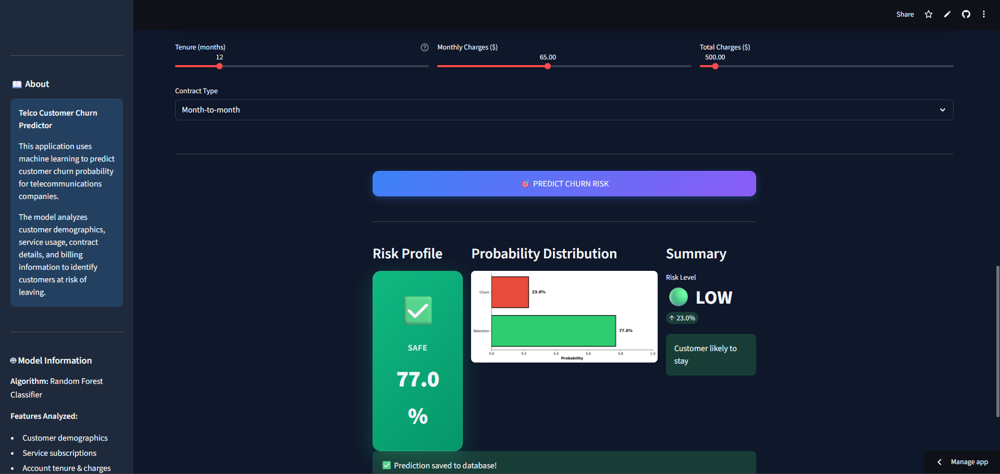
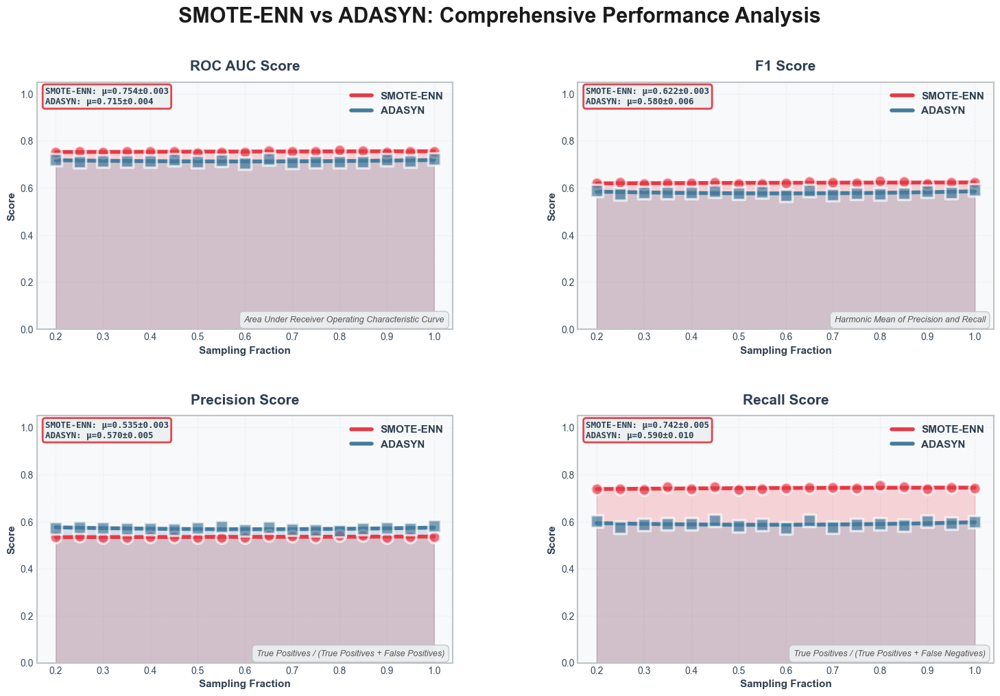
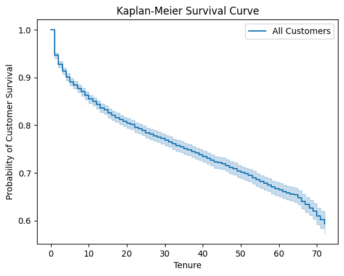
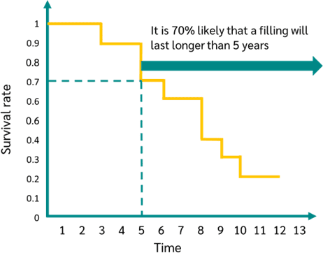

# 📱 Telco Customer Churn Predictor

A reproducible Telco customer churn project: dataset, exploratory analysis, model training, survival analysis, a Streamlit demo, and a saved trained model for quick inference.



Overview
- Predicts whether a customer will churn using the Telco Customer Churn dataset.
- Includes EDA, modelling notebooks, survival analysis, model artifact (model.pkl), and a Streamlit UI (app.py) to try the model interactively.
- Uses common Python data science libraries; environment requirements are in requirements.txt.

Quick demo (Run locally)
1. Create a virtual environment and install dependencies:
   ```
   python -m venv .venv
   source .venv/bin/activate   # on macOS/Linux
   .venv\Scripts\activate      # on Windows
   pip install --upgrade pip
   pip install -r requirements.txt
   ```

2. Run the Streamlit app:
   ```
   streamlit run app.py
   ```
   - The app uses the trained model (model.pkl) and the UI is defined in app.py.
   - Open the local URL printed by Streamlit (usually http://localhost:8501).

Optional: run the small model debug script to inspect the pipeline:
```
python debug_model.py
```

Files & Notebooks (quick map)
- app.py — Streamlit application for interactive predictions and dashboard.
- model.pkl — Saved trained model / pipeline used by the app.
- WA_Fn-UseC_-Telco-Customer-Churn.csv — Raw dataset used throughout the analysis.
- requirements.txt — Python dependencies.
- debug_model.py — Small helper to load and inspect model.pkl.
- churnpred.ipynb — Model training pipeline, preprocessing, feature engineering, and evaluation.
- EDA.ipynb — Exploratory data analysis and visualizations.
- survivalanalysis.ipynb — Lifelines-based survival analysis for churn timing.
- Images: model performance.png, smote.png, kaplansurvival.png, keplan.png (used below).

Data provenance
- The dataset WA_Fn-UseC_-Telco-Customer-Churn.csv is a well-known Telco customer churn dataset (commonly distributed by IBM / public sources). See churnpred.ipynb and EDA.ipynb for data exploration and transformations.
- Key preprocessing steps (also implemented in churnpred.ipynb):
  - Remove customerID.
  - Convert TotalCharges to numeric and handle missing values.
  - Binary encode Yes/No columns (Partner, Dependents, PaperlessBilling, Churn, PhoneService).
  - Map gender to numeric.
  - Map "MultipleLines" to numeric (No phone service / No -> 0, Yes -> 1).
  - One-hot encode categorical columns like InternetService, Contract, PaymentMethod.
  - Address class imbalance using SMOTE (see smote.png).
  - Train a scikit-learn pipeline for consistent transformations and model saving.

Model & inference
- The trained model artifact is model.pkl (a scikit-learn pipeline was used in training — see churnpred.ipynb for exact pipeline steps and hyperparameters).
- Quick inference snippet (example). This uses the same preprocessing approach from churnpred.ipynb (prepare_telco_df). Add this to a Python file or notebook and run:

```python
import pickle
import pandas as pd
from pathlib import Path

# 1) Load the model
with open("model.pkl", "rb") as f:
    model = pickle.load(f)

# 2) Load a sample row (or build a dict with feature values)
df = pd.read_csv("WA_Fn-UseC_-Telco-Customer-Churn.csv")
sample = df.iloc[[0]].copy()  # keep as DataFrame

# Minimal preprocessing to match training pipeline
def prepare_telco_df(df):
    if 'customerID' in df.columns:
        df = df.drop('customerID', axis=1)
    df['TotalCharges'] = pd.to_numeric(df['TotalCharges'], errors='coerce').fillna(0)
    # Binary mapping for columns used during training
    bin_cols = ['Partner', 'Dependents', 'PaperlessBilling', 'PhoneService', 'Churn']
    for c in bin_cols:
        if c in df.columns:
            df[c] = df[c].map({'Yes': 1, 'No': 0})
    if 'gender' in df.columns:
        df['gender'] = df['gender'].map({'Male': 0, 'Female': 1})
    if 'MultipleLines' in df.columns:
        df['MultipleLines'] = df['MultipleLines'].map({'No phone service': 0, 'No': 0, 'Yes': 1})
    # One-hot encode same columns used in training. This is minimal — prefer to let a saved pipeline handle this.
    df = pd.get_dummies(df, columns=['InternetService','Contract','PaymentMethod'], drop_first=True)
    return df

X = prepare_telco_df(sample)

# 3) Align columns if the model expects a fixed set — simple approach is to pass exactly what the pipeline expects.
# If model is a pipeline with preprocessing steps, you can pass X directly:
pred_proba = model.predict_proba(X)[:, 1] if hasattr(model, "predict_proba") else None
pred_label = model.predict(X)

print("Predicted label:", pred_label)
print("Predicted probability:", pred_proba)
```

Notes:
- If model.pkl is a pipeline, it should contain preprocessing + estimator and accept raw DataFrame rows (preferred). If it's only an estimator, ensure preprocessing matches the training pipeline exactly.
- Use debug_model.py to inspect pipeline steps and feature names.

Evaluation & results
- Evaluation visuals are included in the repo. Key images:
  
  
  
  

- The notebooks contain details on performance metrics (accuracy, precision/recall, ROC/AUC, confusion matrices) — open churnpred.ipynb for exact numbers and hyperparameters.

Reproduce training & analysis
- Open and run the notebooks:
  - churnpred.ipynb — reproduces preprocessing, training, evaluation, and model saving (model.pkl).
  - EDA.ipynb — walkthrough of data cleaning and EDA plots.
  - survivalanalysis.ipynb — survival analysis using lifelines (Kaplan–Meier and Cox models).
- Jupyter command:
  ```
  jupyter notebook churnpred.ipynb
  ```
  or use JupyterLab.

Optional API
- requirements.txt includes FastAPI and uvicorn; if an API implementation exists (for example in main.py), you can run:
  ```
  uvicorn main:app --reload --port 8000
  ```
  - Replace `main:app` with the actual module and ASGI `app` object name if different. Check main.py to confirm endpoint names and routes.

Troubleshooting
- If the Streamlit app fails to find model.pkl, ensure current working directory contains model.pkl or update the path in app.py.
- If feature alignment errors appear during inference, inspect the pipeline inside model.pkl (debug_model.py prints named steps) and ensure incoming DataFrame has the same column names as training.
- If packages conflict, create an isolated virtual environment and install the versions in requirements.txt.

Contributing
- Feel free to open issues or pull requests for improvements — e.g., add unit tests, CI, Dockerfile, or a hosted demo.
- To improve reproducibility: add a strict environment file (conda or pip-compile), and provide a small test dataset and unit tests.


Acknowledgements & references
- Telco Customer Churn dataset (public dataset often attributed to IBM sample data).
- lifelines for survival analysis, scikit-learn for modeling, Streamlit for the web UI.
- See churnpred.ipynb and survivalanalysis.ipynb for references & citations used in the notebooks.

Contact
- For questions or help reproducing results, open an issue in this repository with details and logs.

Enjoy exploring the Telco churn dataset and experimenting with the model and app!
